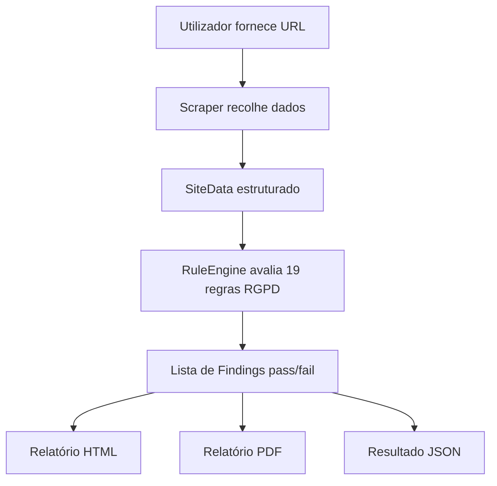

# Vigilantia

> Ferramenta de análise automática de websites com foco em conformidade RGPD e boas práticas de privacidade.

## Visão Geral

A **Vigilantia** é uma aplicação Python que recebe um URL, visita o website, recolhe dados relevantes e avalia automaticamente a conformidade com o RGPD. Gera relatórios HTML, PDF e JSON com as não-conformidades detetadas e recomendações de correção.

> **Nota:** a Vigilantia é uma ferramenta de apoio técnico e **não substitui uma auditoria jurídica profissional**.

---

## Funcionalidades

**Módulo de Scraping (João)**
- Recolha de HTML de páginas estáticas e dinâmicas (Playwright)
- Extração de cookies, scripts de terceiros, formulários e links
- Deteção de política de privacidade e banner de consentimento
- Classificação de scripts por categoria (analytics, advertising, social)

**Módulo Analisador RGPD (Diogo)**
- 19 regras RGPD verificadas automaticamente por categoria:
  - Consentimento, Cookies, Scripts de Terceiros, Formulários, Política de Privacidade
- Motor de regras configurável via `rules/gdpr_rules.yaml`
- Deteção de idioma da política de privacidade (spaCy/langdetect) e verificação por keyword matching
- Geração de relatórios HTML, PDF e JSON
- CLI completa com flags para todos os formatos de saída

---

## Tecnologias

| Biblioteca | Finalidade |
|---|---|
| `requests` + `BeautifulSoup4` | Scraping de páginas estáticas |
| `Playwright` | Navegação em páginas com JavaScript |
| `Pydantic` | Validação e estruturação dos dados |
| `PyYAML` | Carregamento das regras RGPD |
| `Jinja2` | Templates HTML para relatórios |
| `WeasyPrint` | Geração de PDF a partir de HTML |
| `spacy` | Deteção de idioma e NLP (opcional, com fallback) |
| `langdetect` | Deteção de idioma da política de privacidade (fallback) |
| `Typer` | Interface de linha de comandos |

---

## Estrutura do Projeto

```text
vigilantia/
├── src/
│   ├── scraper/
│   │   ├── fetcher.py           # HTTP estático
│   │   ├── playwright_fetcher.py# browser dinâmico
│   │   ├── extractor.py         # parsing HTML
│   │   └── collector.py         # orquestração do scraping
│   ├── analyzer/
│   │   ├── rule_engine.py       # motor de regras RGPD
│   │   ├── privacy_text.py      # deteção de idioma e keyword matching
│   │   └── reporter.py          # geração HTML/PDF/JSON
│   ├── models/
│   │   ├── site_data.py         # contrato de dados scraper→analyzer
│   │   └── finding.py           # schema de uma não-conformidade
│   └── cli.py                   # ponto de entrada CLI
├── rules/
│   └── gdpr_rules.yaml          # 19 regras RGPD configuráveis
├── templates/
│   └── report.html.j2           # template do relatório
├── scripts/
│   └── append_scan.py           # atualiza histórico e manifest
├── tests/
│   ├── test_rule_engine.py
│   ├── test_reporter.py
│   ├── test_cli.py
│   └── test_scraper.py
└── pyproject.toml
```

---

## Fluxo da Aplicação



---

## Instalação

```bash
git clone https://github.com/<username>/<repo>.git
cd vigilantia
py -3.14 -m venv .venv        # Windows (requer Python >= 3.14 localmente)
.venv\Scripts\activate
pip install .
python -m playwright install --with-deps chromium
```

> **Nota:** os pipelines de CI correm em Python 3.13 (runners do GitHub ainda não têm 3.14). Localmente é necessário Python 3.14 ou superior conforme definido em `pyproject.toml`.

---

## Utilização da CLI

```bash
python -m src.cli --help
```

Deve ser executado a partir da raiz do projeto. A CLI tem dois comandos: `analyze` e `serve`.

### analyze — analisar um site

```
Usage: python -m src.cli analyze [OPTIONS] URL

Options:
  -o, --output PATH    Guardar resultado JSON neste ficheiro
  --html PATH          Gerar relatório HTML neste ficheiro
  --pdf PATH           Gerar relatório PDF neste ficheiro
  -r, --rules PATH     Ficheiro de regras YAML  [default: rules/gdpr_rules.yaml]
  -q, --quiet          Mostrar apenas não-conformidades
  --no-history         Não guardar resultados em docs/data/ nem gerar PDF automático
```

### serve — abrir o dashboard localmente

```
Usage: python -m src.cli serve [OPTIONS]

Options:
  -p, --port INTEGER   Porta do servidor  [default: 8080]
  --no-browser         Não abrir o browser automaticamente
```

### Exemplos

Análise rápida (guarda automaticamente em `docs/data/` e gera PDF se essa pasta existir):
```bash
python -m src.cli analyze https://exemplo.com
```

Gerar relatório HTML e guardar JSON:
```bash
python -m src.cli analyze https://exemplo.com --html relatorio.html --output resultado.json
```

Modo silencioso sem atualizar o dashboard:
```bash
python -m src.cli analyze https://exemplo.com --quiet --no-history
```

Abrir o dashboard localmente:
```bash
python -m src.cli serve
# → abre automaticamente http://localhost:8080
```

---

## Dashboard Local

O dashboard (`docs/index.html`) usa `fetch()` e não funciona diretamente com `file://`. É necessário um servidor HTTP.

### Arrancar o servidor

```bash
python -m src.cli serve
```

Abre automaticamente **http://localhost:8080** no browser. Para parar: `Ctrl+C`.

Porta alternativa:
```bash
python -m src.cli serve --port 9000
```

### Popular o dashboard com dados

Cada análise guarda automaticamente o resultado em `docs/data/` e atualiza `manifest.json` se essa pasta existir:

```bash
python -m src.cli analyze https://sapo.pt --quiet
python -m src.cli analyze https://publico.pt --quiet
python -m src.cli analyze https://dn.pt --quiet
```

Os resultados ficam em `docs/data/<site>.json`, o `manifest.json` é atualizado automaticamente e o dashboard atualiza ao recarregar a página.

### GitHub Pages

O dashboard está disponível em `https://<username>.github.io/<repo>/` (GitHub Pages configurado em **Settings → Pages → Branch: main / Folder: /docs**). É atualizado automaticamente sempre que o workflow `scan.yml` corre com `commit_results` ativo.

O dashboard inclui um botão **▶ Run Scan** que abre diretamente a página do workflow no GitHub (só visível quando acedido via GitHub Pages).

---

## GitHub Actions — Scans Automáticos

O repositório tem dois workflows em `.github/workflows/`:

---

### CI — Testes automáticos (`ci.yml`)

Corre automaticamente em cada **push** ou **pull request** para `main`. Não requer configuração.

```
push para main  →  GitHub Actions corre pytest automaticamente
```

> Os testes de CI cobrem `test_rule_engine.py` e `test_reporter.py`. Para correr todos os testes localmente ver a secção [Testes](#testes).

---

### GDPR Scan — Análise on-demand (`scan.yml`)

Corre manualmente quando quiseres. Analisa um ou mais sites e atualiza o dashboard.

**Passo a passo:**

1. Vai ao repositório no GitHub
2. Clica no separador **Actions**
3. No menu lateral, clica em **GDPR Scan (On Demand)**
4. Clica no botão **Run workflow**
5. Preenche os campos:

| Campo | Descrição | Exemplo |
|---|---|---|
| `sites` | Site(s) predefinidos | `all`, `sapo`, `publico`, `rtp` |
| `custom_url` | URL personalizado (opcional) | `https://dn.pt` |
| `custom_label` | Label para o URL personalizado | `dn_pt` |
| `commit_results` | Guardar no repo e atualizar dashboard | `true` |

6. Clica em **Run workflow** (botão verde)

O workflow corre o scraper, gera o relatório e — se `commit_results` estiver ativo — faz commit dos resultados para `docs/data/`. O `manifest.json` é atualizado automaticamente.

**Exemplo — analisar todos os sites predefinidos:**
- `sites` → `all`
- `custom_url` → *(vazio)*
- `commit_results` → `true`

**Exemplo — analisar um site novo:**
- `sites` → `all` *(ou qualquer valor — é ignorado quando `custom_url` está preenchido)*
- `custom_url` → `https://dn.pt`
- `custom_label` → `dn_pt`
- `commit_results` → `true`

> **Atenção:** o valor `none` em `sites` só é válido quando `custom_url` e `custom_label` estão ambos preenchidos. Se `sites` for `none` e `custom_url` estiver vazio, o workflow termina com erro.

---

## Regras RGPD

As regras estão definidas em `rules/gdpr_rules.yaml` e podem ser editadas ou estendidas sem alterar código.

| ID | Categoria | Regra |
|----|-----------|-------|
| RGPD-01 | Consentimento | Banner de consentimento de cookies |
| RGPD-02 | Cookies | Cookies de terceiros sem consentimento |
| RGPD-03 | Cookies | Cookies de tracking sem flag Secure |
| RGPD-04 | Cookies | Cookies de sessão sem flag HttpOnly |
| RGPD-05 | Terceiros | Scripts de analytics sem consentimento |
| RGPD-06 | Terceiros | Scripts de publicidade sem consentimento |
| RGPD-07 | Formulários | Formulários sem aviso de privacidade |
| RGPD-08 | Formulários | Formulários com dados pessoais via GET |
| RGPD-09 | Política | Ausência de link para política de privacidade |
| RGPD-10 | Política | Política não menciona consentimento |
| RGPD-11 | Política | Política não menciona direito ao apagamento |
| RGPD-12 | Política | Política não identifica o responsável pelo tratamento |
| RGPD-13 | Política | Política não menciona contacto do DPO |
| RGPD-14 | Política | Idioma da política diferente do idioma do site |
| RGPD-15 | Política | Política não menciona direito de acesso aos dados |
| RGPD-16 | Política | Política não menciona transferências internacionais |
| RGPD-17 | Política | Política não indica prazo de conservação dos dados |
| RGPD-18 | Formulários | Campo de password sem autocomplete adequado |
| RGPD-19 | Terceiros | Google Analytics Universal sem anonimização de IP |

---

## Testes

```bash
python -m pytest tests/ -v
```

> Alguns testes (`test_cli.py`, `test_scraper.py`) requerem Playwright instalado e acesso à rede. Para correr apenas o subconjunto coberto por CI:
> ```bash
> python -m pytest tests/test_rule_engine.py tests/test_reporter.py -v
> ```

---

## Roadmap

- [x] Estrutura base do projeto
- [x] Scraping estático com `requests`
- [x] Scraping dinâmico com `Playwright`
- [x] Extração de cookies, scripts, formulários e links
- [x] Deteção de política de privacidade e banner de consentimento
- [x] Modelos de dados com Pydantic (`SiteData`, `Finding`)
- [x] 19 regras RGPD configuráveis em YAML
- [x] Motor de regras com avaliadores explícitos por regra
- [x] Deteção de idioma e keyword matching na política de privacidade
- [x] Geração de relatório HTML e PDF
- [x] CLI completa com Typer
- [x] Testes automáticos (rule engine, reporter, scraper, cli)
- [x] CI/CD com GitHub Actions (unit tests + scan on-demand)
- [x] Dashboard GitHub Pages com resultados por site e histórico
- [x] DISCLAIMER.md (aviso legal obrigatório)
- [x] Gráfico de barras no relatório HTML
- [x] Download do relatório PDF a partir do dashboard
- [ ] Análise de múltiplas páginas por domínio

---

## Autores

- **João Rêgo** — módulo de scraping (`src/scraper/`, `src/models/site_data.py`)
- **Diogo Duarte** — módulo analisador RGPD (`src/analyzer/`, `src/models/finding.py`, `rules/`, `templates/`, `src/cli.py`, `scripts/`, `docs/`, `.github/workflows/`)

---

## Aviso

Este projeto foi desenvolvido com fins académicos e de aprendizagem nas áreas de **cibersegurança**, **web scraping** e **privacidade digital**.
