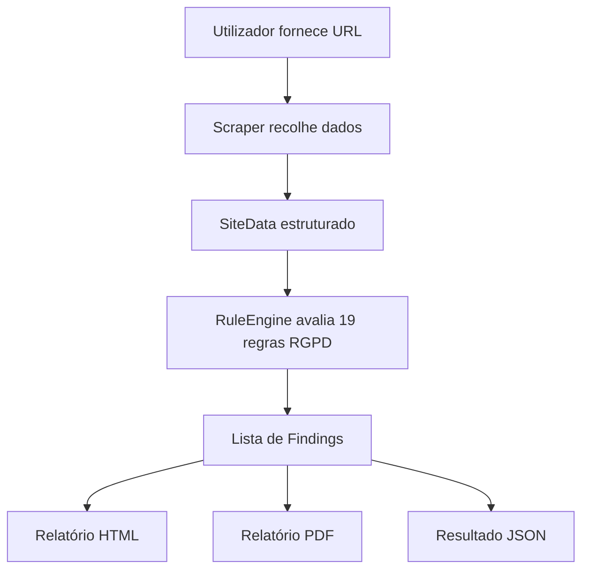

# Vigilantia

> Ferramenta de análise automática de websites com foco em conformidade RGPD e boas práticas de privacidade.

## Visão Geral

A **Vigilantia** é uma aplicação Python em linha de comandos que recebe um URL, visita o website, recolhe dados relevantes e avalia automaticamente sinais técnicos e textuais associados à conformidade com o RGPD. A aplicação gera relatórios em HTML, PDF e JSON com as não-conformidades detetadas, as evidências encontradas e recomendações de correção.

> **Nota:** a Vigilantia é uma ferramenta de apoio técnico e **não substitui uma auditoria jurídica profissional**.

## Evolução do projeto

A versão final da Vigilantia não surgiu de forma direta. O projeto foi sendo refinado até chegar à arquitetura atual, mais modular e mais estável.

### O que foi mantido
- Scraping de páginas estáticas com `requests` + `BeautifulSoup4`.
- Scraping de páginas dinâmicas com `Playwright`.
- Estrutura de dados validada com `Pydantic`.
- CLI construída com `Typer`.
- Relatórios em HTML, PDF e JSON.
- Motor de regras RGPD configurável por ficheiro YAML.

### O que foi adicionado
- Deteção de banner de consentimento e política de privacidade.
- Classificação de scripts por categoria.
- Deteção de idioma e keyword matching sobre texto de privacidade.
- Dashboard local com histórico de análises.
- Scripts `.bat` para facilitar setup, execução e testes no Windows.
- Suite de testes automatizados para garantir estabilidade.

### O que foi removido ou simplificado
- Soluções mais pesadas ou menos estáveis para geração de relatórios foram substituídas por uma abordagem mais direta com template HTML e PDF.
- A interface foi simplificada para uma CLI clara, com comandos principais bem definidos.
- O fluxo da aplicação foi consolidado num pipeline único: recolha, estruturação, análise e exportação.

## Funcionalidades

**Módulo de Scraping**
- Recolha de HTML em páginas estáticas com `requests` + `BeautifulSoup4`.
- Recolha de páginas dinâmicas com `Playwright`.
- Extração de cookies, scripts, formulários e links úteis.
- Deteção de política de privacidade e banner de consentimento.
- Classificação de scripts por categoria, como analytics, advertising e social.

**Módulo Analisador RGPD**
- 19 regras RGPD verificadas automaticamente por categoria.
- Motor de regras configurável via `rules/gdpr_rules.yaml`.
- Deteção de idioma da política de privacidade com `spacy` e `langdetect` como fallback.
- Verificação por keyword matching em texto de privacidade.
- Geração de relatórios HTML, PDF e JSON.
- CLI completa com flags para todos os formatos de saída.

## Tecnologias

| Biblioteca | Finalidade |
|---|---|
| `requests` + `BeautifulSoup4` | Scraping de páginas estáticas |
| `Playwright` | Navegação em páginas com JavaScript |
| `Pydantic` | Validação e estruturação dos dados |
| `PyYAML` | Carregamento das regras RGPD |
| `Jinja2` | Template HTML do relatório |
| `WeasyPrint` | Geração de PDF a partir de HTML |
| `spacy` | Deteção de idioma e NLP (opcional, com fallback) |
| `langdetect` | Fallback para deteção de idioma |
| `Typer` | Interface de linha de comandos |
| `pytest` | Execução da suite de testes |
| `Ruff` | Linting e formatação do código |

## Estrutura do Projeto

```text
vigilantia/
├── src/
│   ├── scraper/
│   │   ├── fetcher.py            # HTTP estático
│   │   ├── playwright_fetcher.py # browser dinâmico
│   │   ├── extractor.py          # parsing HTML
│   │   └── collector.py          # orquestração do scraping
│   ├── analyzer/
│   │   ├── rule_engine.py       # motor de regras RGPD
│   │   ├── privacy_text.py      # idioma e keyword matching
│   │   └── reporter.py          # geração HTML/PDF/JSON
│   ├── models/
│   │   ├── site_data.py         # contrato de dados scraper→analyzer
│   │   └── finding.py           # schema de uma não-conformidade
│   └── cli.py                   # ponto de entrada CLI
├── bat/
│   ├── setup.bat                # setup automático do ambiente
│   ├── scan.bat                 # executar análise
│   ├── dashboard.bat            # abrir dashboard local
│   ├── tests.bat                # correr testes
│   └── LEIAME.txt               # documentação dos scripts
├── rules/
│   └── gdpr_rules.yaml          # 19 regras RGPD configuráveis
├── templates/
│   └── report.html.j2           # template do relatório HTML
├── scripts/
│   └── append_scan.py           # atualiza histórico e manifest
├── docs/
│   ├── index.html               # dashboard web
│   └── data/                    # histórico de scans
├── tests/
│   ├── test_rule_engine.py
│   ├── test_reporter.py
│   ├── test_cli.py
│   └── test_scraper.py
└── pyproject.toml
```

## Fluxo da Aplicação



## Instalação

### Pré-requisitos

- **Python 3.14+** — [python.org/downloads](https://www.python.org/downloads/)
- **Git**

> **PowerShell — erro de política de execução:** se aparecer `running scripts is disabled`, corre uma vez no PowerShell antes de continuar:
>
> ```powershell
> Set-ExecutionPolicy -ExecutionPolicy RemoteSigned -Scope CurrentUser
> ```

### Setup automático (recomendado)

Clona o repositório e corre `bat\setup.bat` — cria o ambiente virtual, instala todas as dependências e o browser do Playwright automaticamente:

```bash
git clone https://github.com/<username>/<repo>.git
cd vigilantia
bat\setup.bat
```

O `bat\setup.bat` só faz o setup completo na primeira execução. Nas seguintes apenas ativa o ambiente.

### Setup manual

```bash
py -3.14 -m venv .venv
.venv\Scripts\activate
pip install -e .
pip install pytest
python -m playwright install chromium
```

> **PDF:** a geração de PDF usa `WeasyPrint`. Em Windows, se surgirem erros com fontes ou Cairo, consultar a documentação oficial.

## Scripts Windows

Os scripts estão na pasta `bat\`. Na primeira execução fazem o setup completo automaticamente. Ver `bat\LEIAME.txt` para documentação detalhada.

| Script | O que faz |
|---|---|
| `bat\setup.bat` | Cria `.venv`, instala dependências e Playwright |
| `bat\scan.bat <URL> [opções]` | Analisa um site e guarda resultados em `docs/data/` |
| `bat\dashboard.bat` | Abre o dashboard local |
| `bat\tests.bat` | Corre a suite de testes com `pytest` |

## Utilização da CLI

```bash
python -m src.cli --help
```

A CLI tem dois comandos principais: `analyze` e `serve`.

### analyze — analisar um site

```text
Usage: python -m src.cli analyze [OPTIONS] URL

Options:
  -o, --output PATH    Guardar resultado JSON neste ficheiro
  --html PATH          Gerar relatório HTML neste ficheiro
  --pdf PATH           Gerar relatório PDF neste ficheiro
  -r, --rules PATH     Ficheiro de regras YAML  [default: rules/gdpr_rules.yaml]
  -q, --quiet          Mostrar apenas não-conformidades
  --no-history         Não guardar resultados em docs/data/
```

### serve — abrir o dashboard localmente

```text
Usage: python -m src.cli serve [OPTIONS]

Options:
  -p, --port INTEGER   Porta do servidor  [default: 8080]
  --no-browser         Não abrir o browser automaticamente
```

## Dashboard Local

O dashboard (`docs/index.html`) usa `fetch()` e não funciona diretamente com `file://`. É necessário um servidor HTTP.

```bash
python -m src.cli serve
```

Isto abre automaticamente o dashboard em `http://localhost:8080`.

## Regras RGPD

As regras estão definidas em `rules/gdpr_rules.yaml` e podem ser editadas ou estendidas sem alterar código.

| ID | Categoria | Regra |
|----|-----------|-------|
| RGPD-01 | Consentimento | Banner de consentimento de cookies |
| RGPD-02 | Cookies | Cookies de terceiros sem consentimento |
| RGPD-03 | Cookies | Cookies de tracking sem flag Secure |
| RGPD-04 | Cookies | Cookies de sessão sem flag HttpOnly |
| RGPD-05 | Terceiros | Scripts de analytics sem consentimento |
| RGPD-06 | Terceiros | Scripts de publicidade sem consentimento |
| RGPD-07 | Formulários | Formulários sem aviso de privacidade |
| RGPD-08 | Formulários | Formulários com dados pessoais via GET |
| RGPD-09 | Política | Ausência de link para política de privacidade |
| RGPD-10 | Política | Política não menciona consentimento |
| RGPD-11 | Política | Política não menciona direito ao apagamento |
| RGPD-12 | Política | Política não identifica o responsável pelo tratamento |
| RGPD-13 | Política | Política não menciona contacto do DPO |
| RGPD-14 | Política | Idioma da política diferente do idioma do site |
| RGPD-15 | Política | Política não menciona direito de acesso aos dados |
| RGPD-16 | Política | Política não menciona transferências internacionais |
| RGPD-17 | Política | Política não indica prazo de conservação dos dados |
| RGPD-18 | Formulários | Campo de password sem autocomplete adequado |
| RGPD-19 | Terceiros | Google Analytics Universal sem anonimização de IP |

## Testes

```bash
python -m pytest tests/ -v
```

## Roadmap

- [x] Estrutura base do projeto
- [x] Scraping estático com `requests`
- [x] Scraping dinâmico com `Playwright`
- [x] Extração de cookies, scripts, formulários e links
- [x] Deteção de política de privacidade e banner de consentimento
- [x] Modelos de dados com Pydantic (`SiteData`, `Finding`)
- [x] 19 regras RGPD configuráveis em YAML
- [x] Motor de regras com avaliadores explícitos por regra
- [x] Deteção de idioma e keyword matching na política de privacidade
- [x] Geração de relatório HTML, PDF e JSON
- [x] CLI completa com Typer
- [x] Testes automáticos
- [x] DISCLAIMER.md (aviso legal obrigatório)
- [x] Dashboard local com histórico de scans
- [ ] Análise de múltiplas páginas por domínio

## Autores

- **João Rêgo** — módulo de scraping
- **Diogo Duarte** — módulo analisador RGPD

## Aviso

Este projeto foi desenvolvido com fins académicos e de aprendizagem nas áreas de **cibersegurança**, **web scraping** e **privacidade digital**.
